# FleetVision

> A governed computer-vision data pipeline for vehicle-damage analysis, with human-in-the-loop review, external-dataset controls, deduplication, annotation QA, and reproducible evaluation.

FleetVision focuses on the engineering required to turn imperfect vehicle-image collections into traceable evidence for computer-vision experiments. It is a portfolio project, not a production SaaS product or an automated insurance decision system.

**中文摘要：** FleetVision 是一套車損影像資料治理與分析流程，重點包含 metadata、人工審核、外部資料接收、去重、標註 QA 與可重現評估。目前技術開發暫停於 `Phase 05S-A2`，正進行作品集維護；before/after 車損比較與完整產品化仍未完成。

**Current status:** `Phase 05S-A2 — Implementation Plan Approved and Documented` · Technical development `PAUSED` · Activity `PORTFOLIO_MAINTENANCE`

## Project Overview

Vehicle-damage modelling is constrained as much by data quality and review discipline as by model architecture. FleetVision therefore treats dataset lineage, schema validation, review state, split safety, and failure-no-overwrite behavior as first-class engineering concerns.

The repository demonstrates how to:

- inventory image metadata and build deterministic review queues;
- operate auditable human-review workflows with local Streamlit interfaces and transactional SQLite state;
- intake external COCO datasets under registry, license, hash, and path-safety controls;
- detect exact duplicates and generate bounded perceptual-duplicate candidates for review;
- canonicalize annotations and validate bounding boxes, class mapping, group leakage, and split balance;
- run validation-only threshold analysis and convert model errors into human-review and data-improvement worklists.

The first detection contract remains YOLOv8 Detect with one class, `damage`. Severity, claimability, liability, and true new-damage decisions are outside the current model contract.

## Key Engineering Highlights

- **Fail-closed data intake:** verifies archive copy integrity, records SHA-256 identity, and validates safe extraction, COCO structure, image references, bounding boxes, and registry evidence before promotion.
- **Deterministic deduplication:** combines SHA-256 with perceptual hashing, bounded candidate generation, explicit cross-source rules, staged outputs, and atomic promotion.
- **Annotation governance:** normalizes source category aliases into the canonical `damage` class while preserving image and annotation IDs, bounding-box geometry, and provenance evidence.
- **Human-in-the-loop review:** uses Traditional Chinese Streamlit workflows, SQLite transactions, resumable progress, append-only audit events, scheduled backups, and controlled exports.
- **Evaluation discipline:** keeps threshold selection and error analysis validation-only and produces traceable error taxonomies and improvement priorities.
- **Safety-oriented testing:** exercises schemas, path constraints, identity checks, rollback/no-overwrite behavior, deterministic ordering, and review-state integrity with synthetic or temporary fixtures.

## System Architecture

```mermaid
flowchart LR
    A[Internal image sources] --> B[Metadata and validation]
    B --> C[Deterministic review queues]
    C --> D[Human review and canonical records]

    E[Governed external sources] --> F[Controlled intake]
    F --> G[Exact deduplication and bounded perceptual candidates]
    G --> H[COCO category canonicalization]
    H --> I[Annotation and split QA]

    D --> J[Reviewed internal artifacts]
    I --> K[QA-controlled external candidates]
    J --> L[YOLO dataset materialization - partial]
    K --> L
    L --> M[Training and inference - partial]
    M --> N[Validation-only evaluation and error analysis]
    N --> O[Streamlit and SQLite review]
    O --> P[Correction proposals and governed exports]
```



Large datasets, model weights, generated review packages, and other protected outputs are intentionally excluded from Git.

## Implementation Status

| Capability | Status | Repository-backed boundary |
|---|---|---|
| Metadata inventory | `IMPLEMENTED` | Config-driven image scanning, stable IDs, dimensions, quality fields, CSV output, and tests. |
| Review pipeline | `IMPLEMENTED` | Deterministic queues, worklists, package builders, validators, mergers, and exports. |
| Human review workflows | `IMPLEMENTED` | Local Streamlit/SQLite workflows with resume, audit events, backups, validation, and no-overwrite exports. |
| External dataset intake | `IMPLEMENTED` | Registry-aware intake, archive copy-integrity checks, SHA-256 recording, safe extraction, COCO inspection, and staged promotion. |
| Deduplication | `IMPLEMENTED` | SHA-256 and perceptual-hash auditing with bounded candidates and cross-source controls. |
| Annotation QA | `IMPLEMENTED` | Category canonicalization plus bounding-box, mapping, leakage, and split-balance validation. |
| YOLO dataset pipeline | `PARTIAL` | A tested dataset builder and configuration exist; final governed materialization depends on approved labels and data gates. |
| Training workflow | `PARTIAL` | Model configuration and governed historical workflow evidence exist; this is not a complete current production training system. |
| Inference | `PARTIAL` | Historical and diagnostic inference evidence exists, but there is no current end-to-end production inference service. |
| Evaluation and error analysis | `IMPLEMENTED` | Validation-only threshold sweeps, one-to-one IoU matching, error taxonomy, and improvement prioritization are implemented and tested. |
| Severity analysis | `PARTIAL` | Review tooling can capture severity/scope evidence; automated severity or claimability decisions are not implemented. |
| Before/after comparison | `PLANNED` | Only supporting IoU logic and an approved team-pairing audit design/plan exist; the damage-comparison workflow itself remains unimplemented. |
| PostgreSQL | `PARTIAL` | A starter schema and Compose service exist; application-level persistence is not integrated end to end. |
| MLflow | `PARTIAL` | A dependency and Compose service exist; complete experiment and model-lifecycle integration is not implemented. |
| Docker | `PARTIAL` | Compose provisions PostgreSQL and MLflow only; it does not define a complete FleetVision application stack. |
| Streamlit / Dashboard | `PARTIAL` | Purpose-built human-review apps and a project-status demo exist; there is no production product dashboard. |
| Automated tests | `IMPLEMENTED` | The suite covers data contracts, review state, QA, safety controls, CLI behavior, and static dashboard assets. |

## Repository Structure

```text
FleetVision/
├── src/fleetvision/
│   ├── data/          # Metadata, intake, deduplication, QA, and dataset builders
│   ├── review/        # Streamlit review workflows, SQLite state, and exports
│   ├── evaluation/    # Validation-only threshold and error analysis
│   └── vision/        # Focused vision utilities
├── scripts/           # Thin CLI and operational entry points
├── configs/           # Versioned data, model, and review contracts
├── tests/             # Synthetic, temporary-path, contract, and regression tests
├── docs/              # Governance, phase evidence, design records, and data guidance
├── sql/               # Starter PostgreSQL schema
├── notebooks/         # Governed historical analysis notebooks
├── demo/              # Project-status presentation assets
└── docker-compose.yml # PostgreSQL and MLflow development services only
```

## Technical Evidence

These files provide a focused review path for engineering managers and interviewers:

1. [Controlled external dataset intake](src/fleetvision/data/intake_external_dataset.py) — safe archive handling, COCO validation, provenance, and staged promotion.
2. [External dataset deduplication](src/fleetvision/data/audit_external_dataset_deduplication.py) — exact/perceptual hashing, bounded candidate search, and atomic output promotion.
3. [COCO category canonicalization](src/fleetvision/data/normalize_external_coco_categories.py) — schema contracts and geometry-preserving normalization.
4. [Annotation and split QA](src/fleetvision/data/validate_external_annotation_split_balance.py) — class mapping, lineage, group leakage, and distribution checks.
5. [Transactional review state](src/fleetvision/review/validation_error_review_state.py) — SQLite transactions, resumable state, audit synchronization, integrity checks, and backups.
6. [Annotation-correction package](src/fleetvision/review/annotation_correction_review_package.py) — verified predecessor evidence, safe paths, deterministic IDs, and review overlays.
7. [Validation error analysis](src/fleetvision/evaluation/baseline_error_analysis.py) — IoU matching, threshold sweeps, error taxonomy, and improvement priorities.

Project decisions and current boundaries are tracked in the [Decision Log](docs/00_project_management/DECISION_LOG.md) and [Project Status](docs/00_project_management/PROJECT_STATUS.md).

## Testing and Quality

Latest local verification on `2026-08-09`:

```text
480 tests collected
479 passed
1 skipped
0 failed
```

The suite includes unit, integration, CLI, package-integrity, rollback/no-overwrite, and static dashboard tests. Most data-path tests use temporary directories and synthetic fixtures to avoid protected datasets.

These results verify software behavior and repository contracts. They do **not** represent model accuracy, deployment readiness, or performance on the frozen test set.

## Quick Start

FleetVision requires Python `3.10+`. The commands below set up the repository and run its tracked test suite without requiring private datasets or model weights.

```powershell
python -m venv .venv
.\.venv\Scripts\Activate.ps1
python -m pip install -e ".[dev]"
python -m pytest -q -p no:cacheprovider
```

Inspect the first data-pipeline entry points without processing data:

```powershell
python scripts/phase01_build_metadata.py --help
python scripts/phase02_build_review_queue.py --help
```

Running data workflows requires separately managed source data, current configuration, and the applicable project gate. Docker is not required for the test suite and does not launch a complete application.

## Limitations and Current Scope

- The repository is an engineering portfolio and governed research workflow, not a production SaaS platform.
- Private images, canonical datasets, external source archives, model weights, and generated outputs are not distributed in Git.
- The frozen test split has already been evaluated once, must not be reused for threshold tuning, and requires an explicit gate for any further access.
- A full before/after same-vehicle, same-view damage comparison workflow remains planned.
- YOLO dataset materialization, training, inference, and deployment are not complete production systems.
- PostgreSQL and MLflow are scaffolding-level services; they are not integrated across the application lifecycle.
- Streamlit is used for local human-review tools, not a customer-facing product dashboard.
- Visible damage evidence must not be interpreted as severity, claimability, liability, or insurance adjudication.

## Project Status

| Field | Current value |
|---|---|
| Technical phase | `Phase 05S-A2 — Implementation Plan Approved and Documented` |
| Technical development | `PAUSED` |
| Current activity | `PORTFOLIO_MAINTENANCE` |
| Last completed technical gate | `PHASE_05S_A2_PLAN_DOCUMENT_APPLICATION_AND_CHECKPOINT` |
| Next technical gate when resumed | `PHASE_05S_A3_IMPLEMENTATION_AUTHORIZATION_BEFORE_CODE` |

Portfolio maintenance does not complete a technical phase or authorize Phase 05S-A3 implementation. The current source of truth starts at [START_HERE](START_HERE.md).
