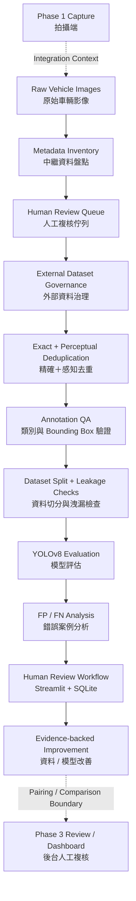

# FleetVision｜車況之眼

> **Evidence-first Computer Vision × Data Engineering × Human-in-the-Loop**  
> 以證據為核心的電腦視覺與資料工程流程，將品質不一的車輛影像轉化為**可治理、可追溯、可人工複核**的車損分析資料。

FleetVision is my **Phase 2 contribution** to a broader three-stage vehicle-condition system. The repository focuses on **metadata quality, human review, external-dataset governance, annotation QA, deduplication, and reproducible evaluation**.

本專案聚焦於三階段車況系統中的 **Phase 2：資料與模型工作流程**。目前公開成果主要證明資料治理、人工複核、外部資料集管理、標註 QA、去重與可重現評估；**不宣稱為自動理賠決策系統或已上線的 production SaaS**。

---

## 專案概覽｜Portfolio Snapshot

| 項目 Item | 內容 Evidence |
|---|---|
| **核心問題 Problem** | 車損模型若缺乏影像來源、人工審核狀態、標註品質與資料切分邊界，模型結果很難被可靠解讀或重現。 |
| **我的主要範圍 My Scope** | Data Governance、Metadata Quality、Annotation QA、Deduplication、Model Evaluation、Human-in-the-Loop Review |
| **模型契約 Model Contract** | YOLOv8 Detect，第一版僅辨識單一類別 `damage` |
| **人工複核 Human Review** | Streamlit + transactional SQLite review state、audit events、backup、controlled export |
| **工程品質 Engineering** | pytest、可重現資料流程、group leakage checks、validation-only error analysis |
| **目前狀態 Status** | `PORTFOLIO_MAINTENANCE`；技術開發暫停，保留既有證據與限制邊界 |

---

## 問題定義｜Problem

車損辨識的困難不只在模型本身。當影像來源不清楚、人工審核狀態無法追蹤、標註品質不一致，或 train / validation / test 之間存在資料洩漏時，即使模型能產生預測，也很難建立可信任的工程結論。

FleetVision 將這些問題視為**資料工程與模型治理需求**，讓後續模型實驗能回溯到已審核的輸入、明確的資料版本與可辯護的評估證據。

Vehicle-damage modelling becomes unreliable when image provenance, review state, annotation quality, and split boundaries are ambiguous. FleetVision treats these controls as engineering requirements so model experiments can be traced back to reviewed inputs and defensible evidence.

➡️ [Project Overview｜專案總覽](docs/01_portfolio/PROJECT_OVERVIEW.md)

---

## 我完成的內容｜What I Built

- **Metadata inventory & review queues｜影像中繼資料與複核佇列**  
  建立 deterministic metadata inventory 與 review queue，讓資料來源與處理狀態可以被追蹤。

- **Human-in-the-Loop review｜人工複核流程**  
  使用 Traditional Chinese Streamlit UI 搭配 transactional SQLite，保存 review state、audit events、backup 與 no-overwrite export。

- **Governed external dataset intake｜外部資料集治理**  
  對外部 COCO 資料建立 registry / license-aware intake，包含 archive identity、safe extraction、staged promotion 與 failure controls。

- **Exact / perceptual deduplication｜精確與感知去重**  
  使用 SHA-256 與 perceptual hash 分離 exact duplicate 與 bounded perceptual review candidates。

- **Annotation QA｜標註品質驗證**  
  進行 geometry-preserving category normalization、bounding-box repair、annotation QA 與 group leakage checks。

- **Model evaluation & error analysis｜模型評估與錯誤分析**  
  建立 validation-only threshold analysis、one-to-one IoU matching，以及 FP / FN worklists，將模型錯誤轉化為下一輪資料改善工作。

The first detection contract is **YOLOv8 Detect** with one class: `damage`.

> Severity、claimability、liability 與真正的 before/after new-damage decision **不屬於目前模型契約**。

---

## 系統架構｜Architecture



較大的團隊系統脈絡為：

```text
Phase 1 Capture
      ↓
Phase 2 FleetVision Data / Model Workflow
      ↓
Pairing / Comparison Boundary
      ↓
Phase 3 Human Review / Dashboard
```

目前 repository 中最完整、最能被驗證的是 **Phase 2 的資料治理、複核與評估流程**。Before / after 同車同角度比較仍未完整完成；Phase 1 與 Phase 3 主要是整合情境，**不作為我的個人實作完成宣稱**。

The repository evidence supports the Phase 2 governance and review workflow most strongly. Before/after comparison remains incomplete, while Phase 1 and Phase 3 are integration context rather than claims of individual implementation.

➡️ [Architecture and Status Semantics｜架構與狀態定義](docs/01_portfolio/ARCHITECTURE.md)

---

## 關鍵工程挑戰｜Key Engineering Challenges

### 1. Fail closed on external intake｜外部資料匯入採失敗即停止

若遇到 unsafe path、invalid COCO reference、identity mismatch 或 partial promotion，流程直接拒絕繼續，避免不完整資料進入正式流程。

### 2. Recoverable review state｜人工複核狀態可恢復

透過 SQLite transaction、resumable progress、audit synchronization 與 controlled export，避免人工標記因中斷或重跑而遺失。

### 3. Prevent leakage and duplicate inflation｜避免資料洩漏與重複膨脹

保留 group boundary，並區分：

```text
Exact Duplicate
vs.
Perceptual Similarity Candidate
```

避免相似圖片錯誤進入不同資料切分，造成評估結果過度樂觀。

### 4. Separate evidence from naming｜資料夾名稱不等於證據

名稱如：

```text
final_selected
dataset_v3
```

本身不代表該 artifact 已通過治理或可被視為正式資料版本。資料身份必須有 registry / lineage evidence 支持。

### 5. Keep evaluation honest｜保持評估邊界

Threshold analysis 僅使用 validation evidence。

**Frozen Test 不提供 tuning、threshold selection 或 error prioritization。**

➡️ [Data Pipeline｜資料流程](docs/01_portfolio/DATA_PIPELINE.md)  
➡️ [Evaluation Methodology｜模型評估方法](docs/01_portfolio/MODEL_EVALUATION.md)

---

## 可驗證成果｜Evidence-Backed Results

目前 repository 可以驗證的工程能力包括：

- deterministic metadata and review-queue generation；
- governed external-dataset intake；
- exact / perceptual deduplication；
- category normalization 與 bounding-box QA；
- group leakage checks；
- transactional human-review state；
- backup / audit / governed export；
- validation-only FP / FN error analysis；
- synthetic / temporary fixtures 驗證大部分 data-path behavior。

The repository demonstrates implemented software contracts plus one explicitly **historical controlled model baseline**.

### Historical Controlled Baseline｜歷史受控模型基準

下列數值均來自 [Results Registry](docs/02_workflow/RESULTS_REGISTRY.md)，並屬於：

`MDL-045J-Y8S-BASELINE`

| Evidence Layer｜證據層 | Precision | Recall | mAP50 | mAP50-95 | Claim Boundary｜宣稱邊界 |
|---|---:|---:|---:|---:|---|
| Training-selected validation summary | `0.4868` | `0.3508` | `0.3516` | `0.1620` | 歷史 validation metrics；不是 deployment result |
| Historical one-time test | `0.5423` | `0.3883` | `0.3804` | `0.1756` | 僅供 reporting；不可用於 tuning / selection / error prioritization |

對應 Registry IDs：

```text
Validation
RES-045J-VAL-P
RES-045J-VAL-R
RES-045J-VAL-MAP50
RES-045J-VAL-MAP5095

Historical Test
RES-045J-TEST-P
RES-045J-TEST-R
RES-045J-TEST-MAP50
RES-045J-TEST-MAP5095
```

### Validation Operating-Point Candidates

另外保留三個 validation operating-point candidates：

| Candidate | Confidence | IoU |
|---|---:|---:|
| `RES-045K-OP-HIGH-RECALL` | `0.05` | `0.5` |
| `RES-045K-OP-BALANCED` | `0.20` | `0.5` |
| `RES-045K-OP-HIGH-PRECISION` | `0.80` | `0.5` |

這些是**分析候選值**，不是 deployment thresholds，也不是 training metrics。

目前：

- 沒有 accepted production-ready final model；
- folder-named `final_selected` artifact 僅為 `BEST_AVAILABLE_POC_ONLY`；
- pytest 通過代表 repository behavior 正確，**不代表模型 accuracy 或 deployment readiness**。

---

## Dataset Governance｜資料集治理

資料身份依照 [Dataset Registry](docs/02_workflow/DATASET_REGISTRY.md)：

- `DS-INT-V1`：protected historical baseline
- `DS-RELABEL-V3-WORKING`：`NOT_CANONICAL` working copy

目前 metric registry 僅能將相關模型指向 Phase 04.5J controlled dataset；在缺乏 lineage evidence 的情況下，本作品集**不會自行把它等同於 `DS-INT-V1`**。

同樣地：

> folder name、legacy export 或 unresolved artifact 都不能單獨建立新的 canonical Dataset v3。

This portfolio deliberately separates dataset identity from folder naming. Canonical status requires lineage and registry evidence.

➡️ [Results and Limitations｜成果與限制](docs/01_portfolio/RESULTS_AND_LIMITATIONS.md)

---

## Demo / Portfolio Assets｜展示素材

Repository 保留一份輕量的：

➡️ [Demo Package Guide](demo/README_demo.md)

大型影片、截圖、簡報、私人影像、資料集、model weights 與 generated review packages 不放入 Git。

其 identity 與 disposition 記錄於：

➡️ [Drive Migration Manifest](docs/02_workflow/DRIVE_MIGRATION_MANIFEST.md)

目前 Drive audit 沒有選定可安全公開且仍有效的 active deck / overview / demo，因此 README 不會以未驗證的展示素材取代 repository evidence。

➡️ [Interview Guide｜面試說明指南](docs/01_portfolio/INTERVIEW_GUIDE.md)

---

## 技術棧｜Tech Stack

### Data / Computer Vision

`Python 3.10+` · `pandas` · `NumPy` · `OpenCV` · `Pillow` · `Ultralytics YOLOv8` · `scikit-learn`

### Review / Persistence

`Streamlit` · `SQLite`

### Engineering

`pytest` · `Git` · `GitHub`

### Supporting Development Services

`PostgreSQL` · `MLflow` · `Docker Compose`

PostgreSQL 與 MLflow 是 [Docker Compose](docker-compose.yml) 中的 supporting development services；目前**不宣稱已完成 end-to-end application integration**。

---

## Repository 導覽｜Repository Tour

| Path | Purpose｜用途 |
|---|---|
| [`src/fleetvision/data/`](src/fleetvision/data/) | Metadata、review queue、external intake、deduplication、canonicalization、QA |
| [`src/fleetvision/review/`](src/fleetvision/review/) | Streamlit / SQLite human-review workflows 與 governed exports |
| [`src/fleetvision/evaluation/`](src/fleetvision/evaluation/) | Validation-only threshold 與 error analysis |
| [`scripts/`](scripts/) | CLI 與 operational entry points |
| [`configs/`](configs/) | Versioned data、review、model 與 QA contracts |
| [`tests/`](tests/) | Unit、integration、CLI、safety 與 regression tests |
| [`docs/01_portfolio/`](docs/01_portfolio/) | Interview-first reading path |
| [`docs/02_workflow/`](docs/02_workflow/) | Current status、handoff、safety 與 artifact ledgers |
| [`docs/03_decisions/`](docs/03_decisions/) | Active decision index |

---

## 重現與測試｜Reproduce / Test

```powershell
python -m venv .venv
.\.venv\Scripts\Activate.ps1
python -m pip install -e ".[dev]"
python -m pytest -q -p no:cacheprovider
```

Tracked test suite 不需要 private dataset 或 model weights。

Data-processing commands 若要實際操作完整資料，仍需要：

- separately managed inputs；
- current configuration；
- applicable project Gate。

The tracked automated tests validate repository behavior using public code plus synthetic / temporary fixtures where applicable.

---

## 限制｜Limitations

- **尚未進行 production deployment，也沒有完整 application stack。**
- **沒有 automated insurance / claimability / liability / pricing / legal decision。**
- Before / after same-vehicle、same-view damage comparison 尚未完整完成。
- Private datasets、model weights、source archives 與 generated artifacts 不公開於 Git。
- 尚未選定 current reference model。
- Historical baseline 不代表 production-ready final model。
- `BEST_AVAILABLE_POC_ONLY` 未通過 production quality gate。
- `DS-INT-V1` 仍是 protected historical baseline。
- Relabel working copy 並不是 canonical Dataset v3。
- Frozen Test access、training、fine-tuning 與 Phase 05S-A3 implementation 在目前 portfolio maintenance 狀態下未授權。

---

## 目前狀態｜Current Status

| Field | Current Value |
|---|---|
| **Technical Phase** | `Phase 05S-A2 — Implementation Plan Approved and Documented` |
| **Technical Development** | `PAUSED` |
| **Current Activity** | `PORTFOLIO_MAINTENANCE` |
| **Last Completed Technical Gate** | `PHASE_05S_A2_PLAN_DOCUMENT_APPLICATION_AND_CHECKPOINT` |
| **Next Technical Gate** | `PHASE_05S_A3_IMPLEMENTATION_AUTHORIZATION_BEFORE_CODE` |
| **A3 Authorized** | `false` |
| **Frozen Test Access** | `false` |

Portfolio maintenance **不會推進 technical phase**。

若未來恢復技術開發，從：

➡️ [`START_HERE.md`](START_HERE.md)

重新確認當前 Gate 與 project state，而不是依賴歷史對話內容。

---

## Engineering Mindset｜工程實作原則

### Evidence → Governance → Evaluation → Review

FleetVision 的核心不是單一模型數字，而是建立一條可以回答以下問題的工程證據鏈：

- 這張圖片從哪裡來？
- 是否經過人工審核？
- 標註是否合法？
- 是否和其他 split 發生重複或洩漏？
- 模型錯在哪裡？
- 下一輪應改善資料、標註還是模型？
- 每一項結論能否回到可追蹤的 evidence？

The project emphasizes **traceability, reproducibility, controlled evaluation, and human review** so that model results remain connected to governed data and explicit evidence boundaries.
