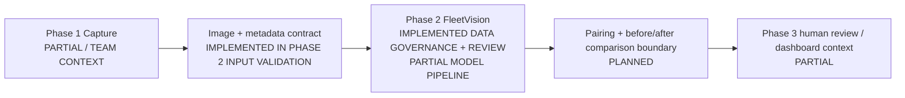
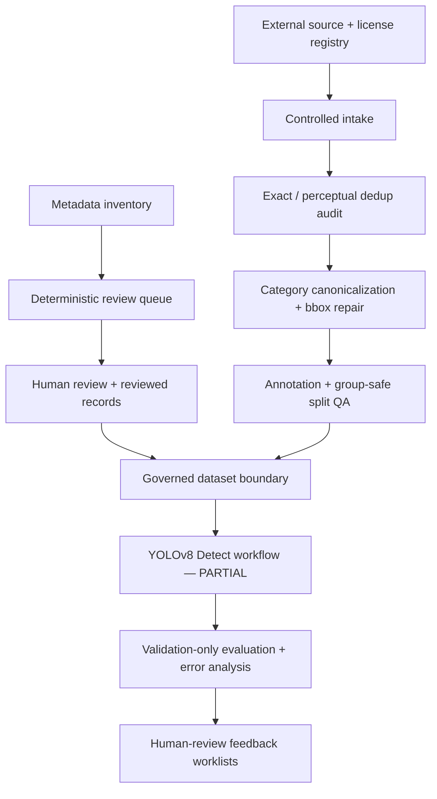

# Architecture

FleetVision separates team-system context from repository-backed implementation status.

## Status Semantics

| Boundary | Status | Evidence-backed interpretation |
|---|---|---|
| Phase 1 capture | `PARTIAL` / team context | The repository defines downstream metadata and image expectations but does not contain a completed first-stage capture product. |
| Image + metadata contract | `IMPLEMENTED` | Metadata scanning, stable identifiers, quality fields, configuration, and tests exist in [`build_metadata.py`](../../src/fleetvision/data/build_metadata.py). |
| Phase 2 data governance and review | `IMPLEMENTED` | Data intake, deduplication, canonicalization, QA, review state, and exports are implemented under [`src/fleetvision/`](../../src/fleetvision/). |
| Phase 2 YOLO dataset/training/inference | `PARTIAL` | Builders, configuration, and historical evidence exist, but current governed materialization, model selection, and production inference are not complete. |
| Pairing and before/after comparison | `PLANNED` | Focused IoU utility support exists in [`compare_damage.py`](../../src/fleetvision/vision/compare_damage.py), but the end-to-end comparison workflow is not implemented. |
| Phase 3 human review/dashboard | `PARTIAL` | Purpose-built local review apps exist; a complete customer-facing dashboard and product integration do not. |

## Phase 2 Internal Flow

Large/private artifacts stay outside Git; Git records code, configuration, tests, current state, decisions, and provenance references. See the [data pipeline](DATA_PIPELINE.md) and [protected-asset contract](../02_workflow/PROTECTED_ASSETS.md).
